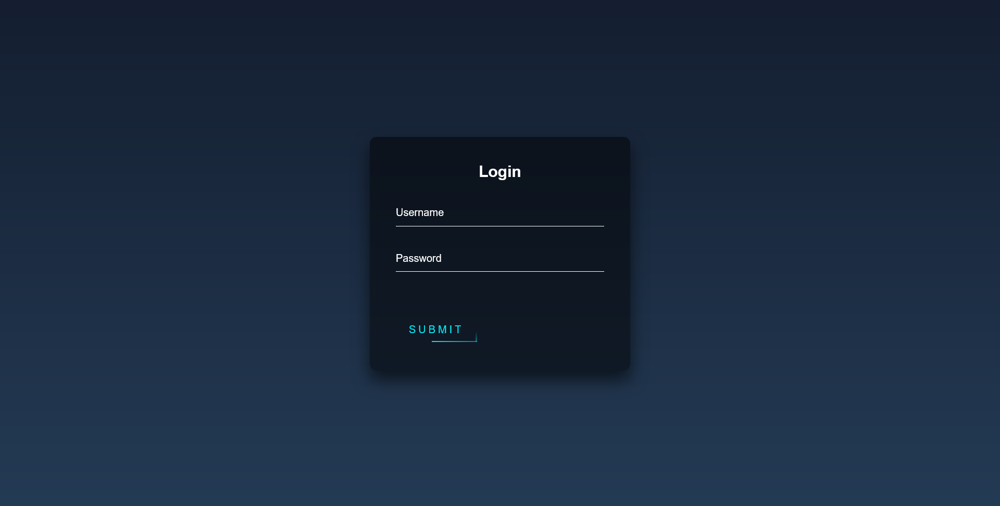
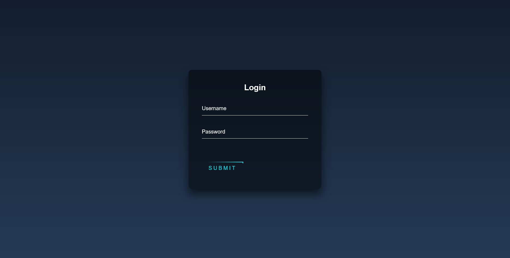
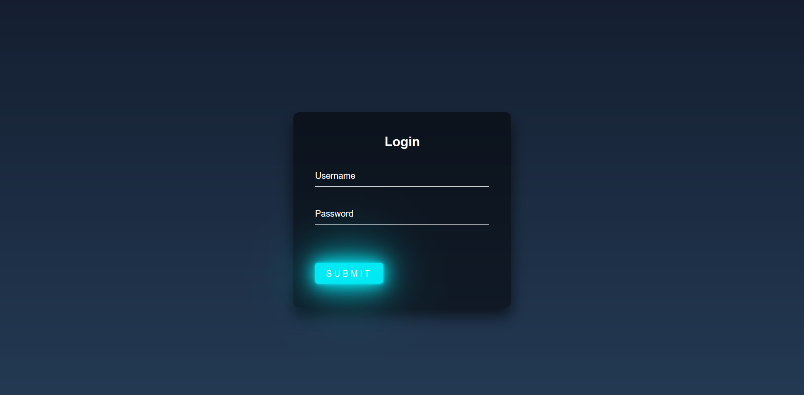

<h1 align="center">Login Form with Animated Button</h1>

    <a href="https://animated-button-login-form.vercel.app/" target="_blank">View Demo</a>

This login form with an animated button is a sleek and visually appealing user interface element that enhances the user experience of logging into a website or application. The form combines stylish design with interactive animations to create an engaging and intuitive login experience.

## Preview

    
    Preview 1
     
     
     
    
    Preview 2
     
     
     
    
    preview that is displayed when hovering over the buttonv(Animated Button)

 

This is a simple login form created using HTML and CSS. The form allows users to enter their login credentials to access a website or application. The design is clean and user-friendly, with input fields for username and password. Additionally, the animation of the submit button is achieved using CSS animations, adding an interactive and visually appealing element to the form.

## Author
 

